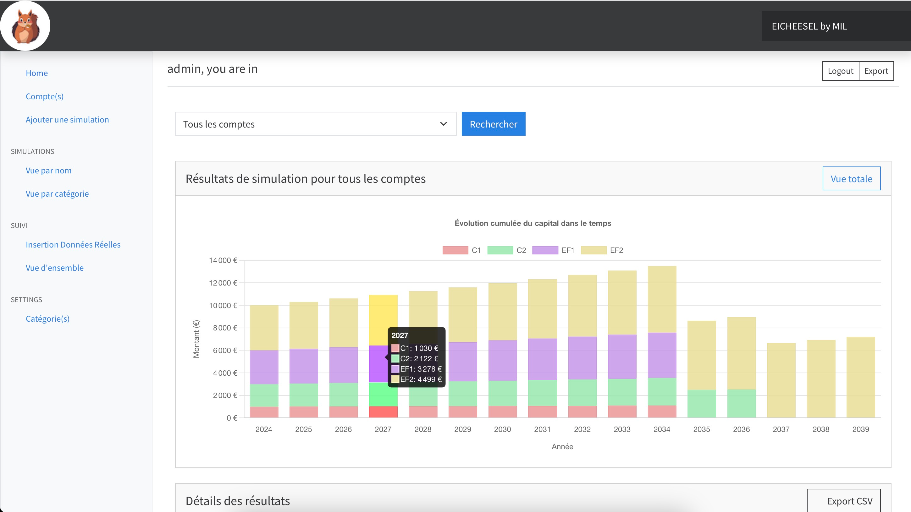

HELP WANTED
If you want to contribute please contact me.
Application still in debug mode



# Eicheesel 🐿️

A savings and long-term investment simulation application by Mil100057

```
     /\___/\
    (  o o  )
    (  =^=  ) 
     (____))
    /      \
```

## Disclaimer

⚠️ Please read carefully:
- This application is for testing and simulation purposes only
- No guarantees are provided regarding calculation results
- You are responsible for your data security
- The application only performs basic calculations and storage
- No financial advice are provided

## Quick Start

### Prerequisites
- Docker
- Docker Daemon running
- Buildx for choosing your version
- In settings.py add: An ALPHAVANTAGE API KEY
   you can get one here https://www.alphavantage.co

### Installation

1. Clone the repository and Build the Docker container:
```bash
gh repo clone Mil100057/My_Eicheesel
cd Eicheesel
docker buildx build --platform=linux/amd64 -t eicheesel (example for linux/amd64 version)
```

2. Prepare the environment:
```bash
nano .env
```

enter you ENV VARIABLES
```bash
DEBUG=0
SECRET_KEY=<YOUR_SECURE_KEY>
API_KEY=<YOUR_AV_API_KEY>
ALLOWED_HOSTS=localhost,127.0.0.1,<your_host_adress_if_needed>
DB_NAME=eicheesel_db
DB_USERNAME=eicheesel
DB_PASSWORD=eicheesel
DB_HOST=db
DB_PORT=5432
```
exit and save nano by CTRL+X and Y

3. Start the application:
```bash
docker compose up
```

Once containers are running
Enter in the terminal of your server container

```bash
python manage.py migrate 
python manage.py createsuperuser
python manage.py collectstatic --no-input
```
⚠️ **Important**: superuser credentials are mandatory, choose a strong password!

### Accessing the Application

- URL: `http://localhost:8080`


### Please signup first as admin
- Username: `<your_super_user_name>`
- Password: `<your_password>`


## Administration

- Admin panel available at: `http://localhost:8080/admin/`
- Use this interface to manage credentials and access the database

## Usage Guide

### Initial Setup
1. **Configure Categories**
   - Go to Settings → Catégorie(s) in the sidebar
   - Select or create categories for your simulations

3. **Start Simulating**
   - Click "Ajouter une simulation" to begin a new simulation

### Customizing Categories

To modify category types:
1. Navigate to the `simulation` folder
2. Edit `models.py`
3. Modify the `Category` class as needed

## Support

For issues or questions, please create an issue in the repository.

---

Made with ❤️ by Mil100057
